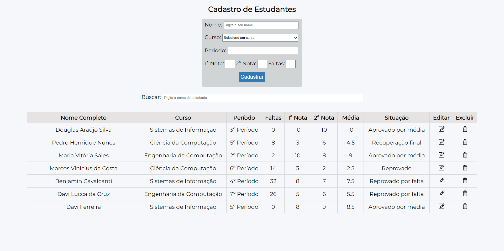
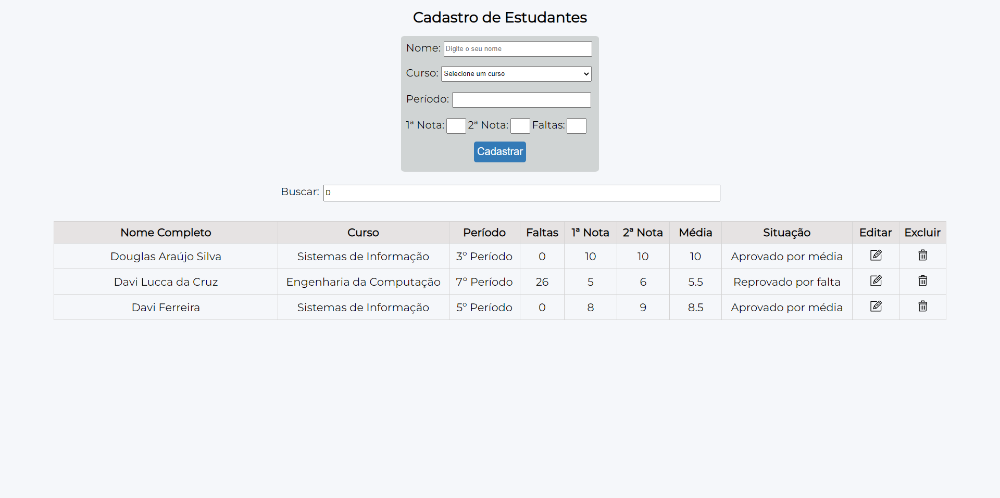

<h1 align="center">Cadastro de Estudantes :clipboard:</h1>

## :memo: Descrição
Nesta tela de cadastro de estudantes, você pode criar, visualizar, atualizar e excluir os dados dos estudantes. Além disso, há uma barra de pesquisa que permite filtrar os dados para encontrar estudantes específicos. Os dados solicitados incluem nome, curso, período, primeira e segunda nota, além da quantidade de faltas. Após o cadastro, a média das notas é calculada e a situação do aluno é determinada com base nas regras do SIG@ (Sistema de Informações e Gestão Acadêmica):
- Se o número de faltas for maior que 18, o aluno será reprovado.
- Se a média for menor que 7, mas maior que 3, o aluno precisará fazer a recuperação final.
- Se a média for menor que 3, o aluno será reprovado.
- Se nenhuma das condições anteriores for atendida, o aluno será aprovado por média. 

## :wrench: Tecnologias utilizadas
- Javascript
- HTML
- CSS

## :camera: Imagens
 

  

  

